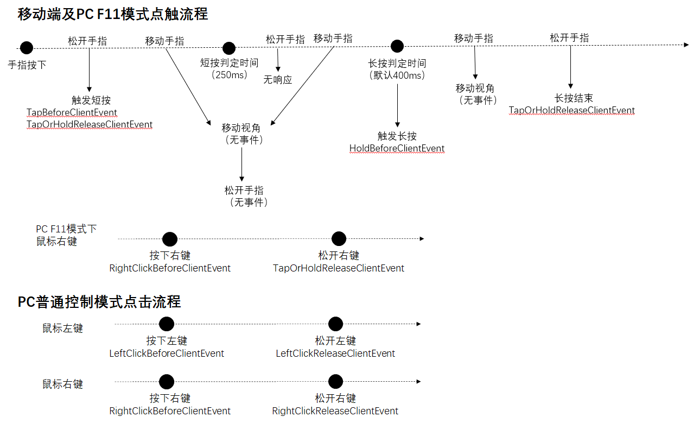

# 控制

# 索引

| 事件 | 

 | 描述 |
| --- | --- | --- |
| [ClientJumpButtonPressDownEvent](控制.md#clientjumpbuttonpressdownevent) | 客户端 | 跳跃按钮按下事件，返回值设置参数只对当次按下事件起作用 |
| [ClientJumpButtonReleaseEvent](控制.md#clientjumpbuttonreleaseevent) | 客户端 | 跳跃按钮按下释放事件 |
| [GetEntityByCoordEvent](控制.md#getentitybycoordevent) | 客户端 | 玩家点击屏幕时触发，多个手指点在屏幕上时，只有第一个会触发。 |
| [GetEntityByCoordReleaseClientEvent](控制.md#getentitybycoordreleaseclientevent) | 客户端 | 玩家点击屏幕后松开时触发，多个手指点在屏幕上时，只有最后一个手指松开时触发。 |
| [HoldBeforeClientEvent](控制.md#holdbeforeclientevent) | 客户端 | 玩家长按屏幕，即将响应到游戏内时触发。仅在移动端或pc的F11模式下触发。pc的非F11模式可以使用RightClickBeforeClientEvent事件监听鼠标右键 |
| [LeftClickBeforeClientEvent](控制.md#leftclickbeforeclientevent) | 客户端 | 玩家按下鼠标左键时触发。仅在pc的普通控制模式（即非F11模式）下触发。 |
| [LeftClickReleaseClientEvent](控制.md#leftclickreleaseclientevent) | 客户端 | 玩家松开鼠标左键时触发。仅在pc的普通控制模式（即非F11模式）下触发。 |
| [OnBackButtonReleaseClientEvent](控制.md#onbackbuttonreleaseclientevent) | 客户端 | 返回按钮（目前特指安卓系统导航中的返回按钮）松开时触发 |
| [OnClientPlayerStartMove](控制.md#onclientplayerstartmove) | 客户端 | 移动按钮按下触发事件，在按住一个方向键的同时，去按另外一个方向键，不会触发第二次 |
| [OnClientPlayerStopMove](控制.md#onclientplayerstopmove) | 客户端 | 移动按钮按下释放时触发事件，同时按下多个方向键，需要释放所有的方向键才会触发事件 |
| [OnKeyPressInGame](控制.md#onkeypressingame) | 客户端 | 按键按下或按键释放时触发 |
| [RightClickBeforeClientEvent](控制.md#rightclickbeforeclientevent) | 客户端 | 玩家按下鼠标右键时触发。仅在pc下触发（普通控制模式及F11模式都会触发）。 |
| [RightClickReleaseClientEvent](控制.md#rightclickreleaseclientevent) | 客户端 | 玩家松开鼠标右键时触发。仅在pc的普通控制模式（即非F11模式）下触发。在F11下右键，按下会触发RightClickBeforeClientEvent，松开时会触发TapOrHoldReleaseClientEvent |
| [TapBeforeClientEvent](控制.md#tapbeforeclientevent) | 客户端 | 玩家点击屏幕并松手，即将响应到游戏内时触发。仅在移动端或pc的F11模式下触发。pc的非F11模式可以使用LeftClickBeforeClientEvent事件监听鼠标左键 |
| [TapOrHoldReleaseClientEvent](控制.md#taporholdreleaseclientevent) | 客户端 | 玩家点击屏幕后松手时触发。仅在移动端或pc的F11模式下触发。pc的非F11模式可以使用LeftClickReleaseClientEvent与RightClickReleaseClientEvent事件监听鼠标松开 |
# 控制

## ClientJumpButtonPressDownEvent

客户端

- 描述

    跳跃按钮按下事件，返回值设置参数只对当次按下事件起作用

- 参数

    | 参数名 | 
数据类型
 | 说明 |
    | :--- | :--- | :--- |
    | continueJump | bool | 设置是否执行跳跃逻辑 |

- 返回值

    无

## ClientJumpButtonReleaseEvent

客户端

- 描述

    跳跃按钮按下释放事件

- 参数

    无

- 返回值

    无

## GetEntityByCoordEvent

客户端

- 描述

    玩家点击屏幕时触发，多个手指点在屏幕上时，只有第一个会触发。

- 参数

    无

- 返回值

    无

## GetEntityByCoordReleaseClientEvent

客户端

- 描述

    玩家点击屏幕后松开时触发，多个手指点在屏幕上时，只有最后一个手指松开时触发。

- 参数

    无

- 返回值

    无

## HoldBeforeClientEvent

客户端

- 描述

    玩家长按屏幕，即将响应到游戏内时触发。仅在移动端或pc的F11模式下触发。pc的非F11模式可以使用RightClickBeforeClientEvent事件监听鼠标右键

- 参数

    | 参数名 | 
数据类型
 | 说明 |
    | :--- | :--- | :--- |
    | cancel | bool | 设置为True可拦截原版的挖方块/使用物品/与实体交互响应 |

- 返回值

    无

- 备注
    - 玩家长按屏幕的处理顺序为：
        1. 玩家点击屏幕，在长按判定时间内（默认为400毫秒，可通过SetHoldTimeThreshold接口修改）一直没有进行拖动或松手
        2. 触发该事件
        3. 若事件没有cancel，则根据主手上的物品，准心处的物体类型以及与玩家的距离，进行挖方块/使用物品/与实体交互等操作
        即该事件只会在到达长按判定时间的瞬间触发一次，后面一直按住不会连续触发，可以使用TapOrHoldReleaseClientEvent监听长按后松手
    - 与TapBeforeClientEvent事件类似，被ui层捕获，没有穿透到世界的点击不会触发该事件

## LeftClickBeforeClientEvent

客户端

- 描述

    玩家按下鼠标左键时触发。仅在pc的普通控制模式（即非F11模式）下触发。

- 参数

    | 参数名 | 
数据类型
 | 说明 |
    | :--- | :--- | :--- |
    | cancel | bool | 设置为True可拦截原版的挖方块或攻击响应 |

- 返回值

    无

## LeftClickReleaseClientEvent

客户端

- 描述

    玩家松开鼠标左键时触发。仅在pc的普通控制模式（即非F11模式）下触发。

- 参数

    无

- 返回值

    无

## OnBackButtonReleaseClientEvent

客户端

- 描述

    返回按钮（目前特指安卓系统导航中的返回按钮）松开时触发

- 参数

    无

- 返回值

    无

- 备注
    - 目前仅安卓平台可用

## OnClientPlayerStartMove

客户端

- 描述

    移动按钮按下触发事件，在按住一个方向键的同时，去按另外一个方向键，不会触发第二次

- 参数

    无

- 返回值

    无

## OnClientPlayerStopMove

客户端

- 描述

    移动按钮按下释放时触发事件，同时按下多个方向键，需要释放所有的方向键才会触发事件

- 参数

    无

- 返回值

    无

## OnKeyPressInGame

客户端

- 描述

    按键按下或按键释放时触发

- 参数

    | 参数名 | 
数据类型
 | 说明 |
    | :--- | :--- | :--- |
    | screenName | str | 当前screenName |
    | key | str | 键码（注：这里的int型被转成了str型，比如"1"对应的就是枚举值文档中的1），详见[KeyBoardType枚举](../枚举值/KeyBoardType.md)| |
    | isDown | str | 是否按下，按下为1，弹起为0 |

- 返回值

    无

## RightClickBeforeClientEvent

客户端

- 描述

    玩家按下鼠标右键时触发。仅在pc下触发（普通控制模式及F11模式都会触发）。

- 参数

    | 参数名 | 
数据类型
 | 说明 |
    | :--- | :--- | :--- |
    | cancel | bool | 设置为True可拦截原版的物品使用/实体交互响应 |

- 返回值

    无

## RightClickReleaseClientEvent

客户端

- 描述

    玩家松开鼠标右键时触发。仅在pc的普通控制模式（即非F11模式）下触发。在F11下右键，按下会触发RightClickBeforeClientEvent，松开时会触发TapOrHoldReleaseClientEvent

- 参数

    无

- 返回值

    无

- 备注
    - pc的普通控制模式下的鼠标点击流程见[TapOrHoldReleaseClientEvent](#taporholdreleaseclientevent)备注中的配图

## TapBeforeClientEvent

客户端

- 描述

    玩家点击屏幕并松手，即将响应到游戏内时触发。仅在移动端或pc的F11模式下触发。pc的非F11模式可以使用LeftClickBeforeClientEvent事件监听鼠标左键

- 参数

    | 参数名 | 
数据类型
 | 说明 |
    | :--- | :--- | :--- |
    | cancel | bool | 设置为True可拦截原版的攻击或放置响应 |

- 返回值

    无

- 备注
    - 玩家点击屏幕的处理顺序为：
        1. 玩家点击屏幕，没有进行拖动，并在短按判定时间（250毫秒）内松手
        2. 触发该事件
        3. 若事件没有cancel，则根据准心处的物体类型以及与玩家的距离，进行攻击或放置等操作
    - 与GetEntityByCoordEvent事件不同的是，被ui层捕获，没有穿透到世界的点击不会触发该事件，例如：
        1. 点击原版的移动/跳跃等按钮，
        2. 通过SetIsHud(0)屏蔽了游戏操作
        3. 对按钮使用AddTouchEventHandler接口时isSwallow参数设置为True

## TapOrHoldReleaseClientEvent

客户端

- 描述

    玩家点击屏幕后松手时触发。仅在移动端或pc的F11模式下触发。pc的非F11模式可以使用LeftClickReleaseClientEvent与RightClickReleaseClientEvent事件监听鼠标松开

- 参数

    无

- 返回值

    无

- 备注
    - 短按及长按后松手都会触发该事件
    - 移动端及pc的F11模式下点触流程见下图
        

