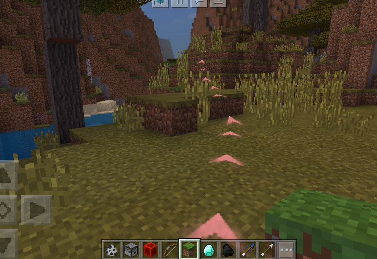

# 导航

## GetNavPath

<span style="display:inline;color:#7575f9">客户端</span>

method in mod.client.extraClientApi

- 描述

    获取本地玩家到目标点的寻路路径，开发者可以通过该接口定制自定义的导航系统。

- 参数

    | 参数名 | <div style="width: 4em">数据类型</div> | 说明 |
    | :--- | :--- | :--- |
    | pos | tuple(float,float,float) | 目标点的坐标 |
    | maxTrimNode | int | 对搜索路径进行平滑时的最大尝试格数。设置的太大会影响寻路性能。默认值16 |
    | maxIteration | int | A星寻路的最大迭代次数。默认值800 |
    | isSwimmer | bool | 目标点是否在水中。默认为False |

- 返回值

    | <div style="width: 4em">数据类型</div> | 说明 |
    | :--- | :--- |
    | int或list(tuple(float,float,float)) | 返回1：参数错误<br>返回2：玩家所在chunk未加载完毕<br>返回3：终点为实心方块，无法寻路<br>返回list(tuple(float,float,float),)：从起点到终点的坐标点列表。注意该list可能为空，表示本地玩家离地太远，或者被堵住无法行动。 |

- 备注
    - 寻路算法迭代一定次数后（即maxIteration的数值），如果未寻到目标点，接口会返回**局部最优解**，即当前搜索到的点的集合中，离设置目标点最近的点的路径，但是这条路径可能是不准确或错误的（例如往终点的方向是死胡同的情况）。<br>出现这种可能的情况包括：目标点无法抵达（被围住等），目标点所在chunk未加载，目标点较远（但是仍在区块加载范围内）或地形较复杂（例如与终点间有很长一面墙）。
    - 上述情况中，目标点较远或地形较复杂的情况可以通过增大maxIteration的数值避免，但是这样同时也会增加客户端的卡顿。
    - 如果终点在水里需要将isSwimmer参数设为True，但如果只是路途中会经过水域是不需要的。但需要注意在水中的寻路性能非常低下，其他参数不变时，单次寻路计算出的最大路径长度会小很多。


## StartNavTo

<span style="display:inline;color:#7575f9">客户端</span>

method in mod.client.extraClientApi

- 描述

    我们提供了一个基于GetNavPath的导航系统实现，做法是在路径上生成序列帧以引导玩家通向目标点，并且当玩家偏离路径会重新进行导航。

- 参数

    | 参数名 | <div style="width: 4em">数据类型</div> | 说明 |
    | :--- | :--- | :--- |
    | pos | tuple(float,float,float) | 目标点的坐标 |
    | sfxPath | str | 构成导航路径的序列帧素材路径。样式可以参考指向上的箭头 |
    | callback | function | 玩家抵达终点时会调用的**回调函数**。该函数需要接受一个bool参数。 |
    | sfxIntl | float | 相邻两个序列帧之间的间隔。默认值2 |
    | sfxMaxNum | int | 同时存在的序列帧的最大个数。默认值16 |
    | sfxScale | tuple(float,float) | 序列帧的宽度及高度的缩放。默认为（0.5，0.5） |
    | maxIteration | int | A星寻路的最大迭代次数。默认值800 |
    | isSwimmer | bool | 目标点是否在水中。默认为False |
    | fps | int | 序列帧帧率，默认为20，不建议超过30 |
    | playIntl | int | 一轮中相邻序列帧开始播放的间隔，默认为8帧，不得小于0，否则将使用默认值 |
    | duration | int | 单个序列帧持续播放帧数，默认为60帧，不小于10，否则将使用默认值 |
    | oneTurnDuration | int | 两轮序列帧之间的播放间隔(帧)，默认值为90帧，至少为duration的1.5倍，否则将以1.5 * duration进行计算 |
    | sfxDepthTest | bool | 序列帧是否开启深度检测，默认为False，设为True时序列帧会被场景遮挡 |

- 返回值

    | <div style="width: 4em">数据类型</div> | 说明 |
    | :--- | :--- |
    | int | 返回0：导航正常开始<br>返回-1：本地玩家离地太远，或者被堵住无法行动<br>返回1：参数错误<br>返回2：玩家所在chunk未加载完毕<br>返回3：终点为实心方块，无法寻路 |

- 备注
    - 寻路算法迭代一定次数后（即maxIteration的数值），如果未寻到目标点，接口会返回**局部最优解**，即当前搜索到的点的集合中，离设置目标点最近的点的路径，但是这条路径可能是不准确或错误的（例如往终点的方向是死胡同的情况）。<br>出现这种可能的情况包括：目标点无法抵达（被围住等），目标点所在chunk未加载，目标点较远（但是仍在区块加载范围内）或地形较复杂（例如与终点间有很长一面墙）。
    - 上述情况中，目标点较远或地形较复杂的情况可以通过增大maxIteration的数值避免，但是这样同时也会增加客户端的卡顿。
    - 如果终点在水里需要将isSwimmer参数设为True，但如果只是路途中会经过水域是不需要的。但需要注意在水中的寻路性能非常低下，其他参数不变时，单次寻路计算出的最大路径长度会小很多。
    - callback函数接受一个bool参数。当参数为True时，表示玩家到达目标点附近，但不代表导航结束，如果玩家又离开目标点，导航系统会再次尝试导航，开发者需要在某个时机手动调用停止导航（参考[StopNav接口](导航.md#StopNav)）。当参数为False时，表示玩家偏离航线并到了某个无法到达目标点的状态（即返回值不为0的那些情况），这种情况导航会自动终止。
        ```python
        # 一个到达终点时停止导航的callback函数示例
        from mod_log import logger as logger
        def myCallback(result):
            if result:
                extraClientApi.StopNav()
            else:
                logger.info('something happened in navigation')
        # 若目标点很远，需要进行分段导航的callback函数示例
        def myCallback2(result):
            if result:
                if GetDistence(localplayerPos, destinationPos) < sfxIntl*2:
                    extraClientApi.StopNav()
                else:
                    extraClientApi.StartNavTo(destinationPos, ...)
            else:
                logger.info('something happened in navigation')
        ```
    - 如果上一次导航没结束时再次调用会覆盖之前的导航
    - 使用默认参数的导航效果示例：<br>


## StopNav

<span style="display:inline;color:#7575f9">客户端</span>

method in mod.client.extraClientApi

- 描述

    终止当前的导航

- 参数

    无

- 返回值

    无


