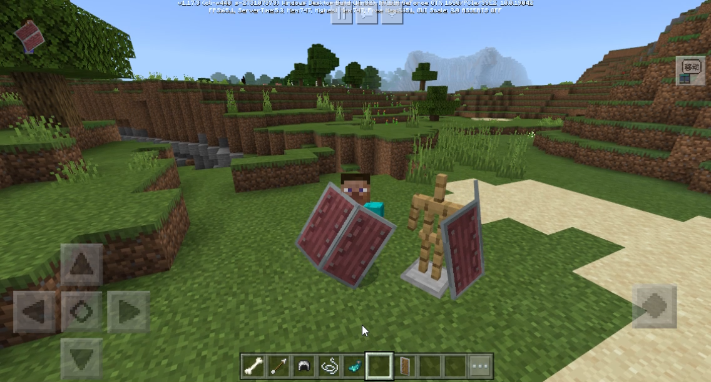
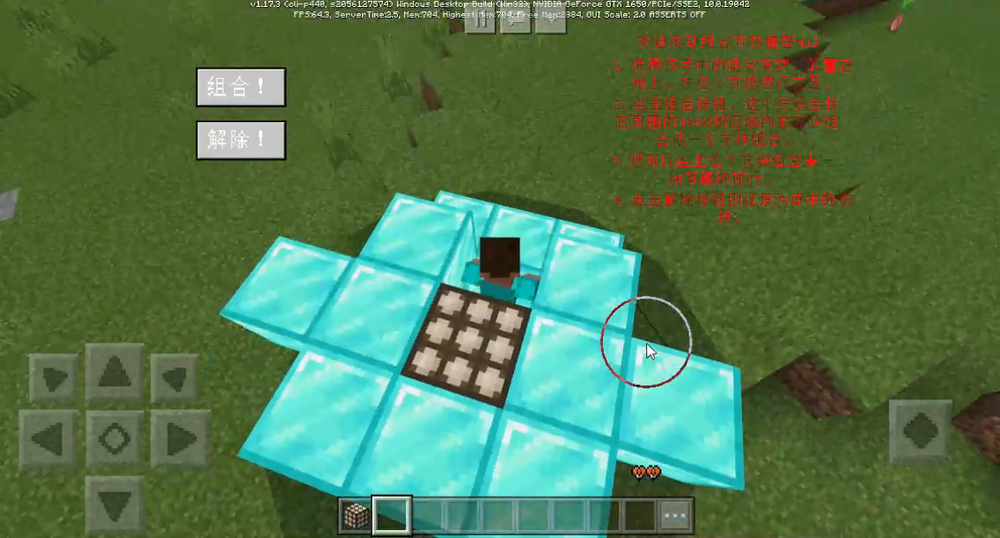
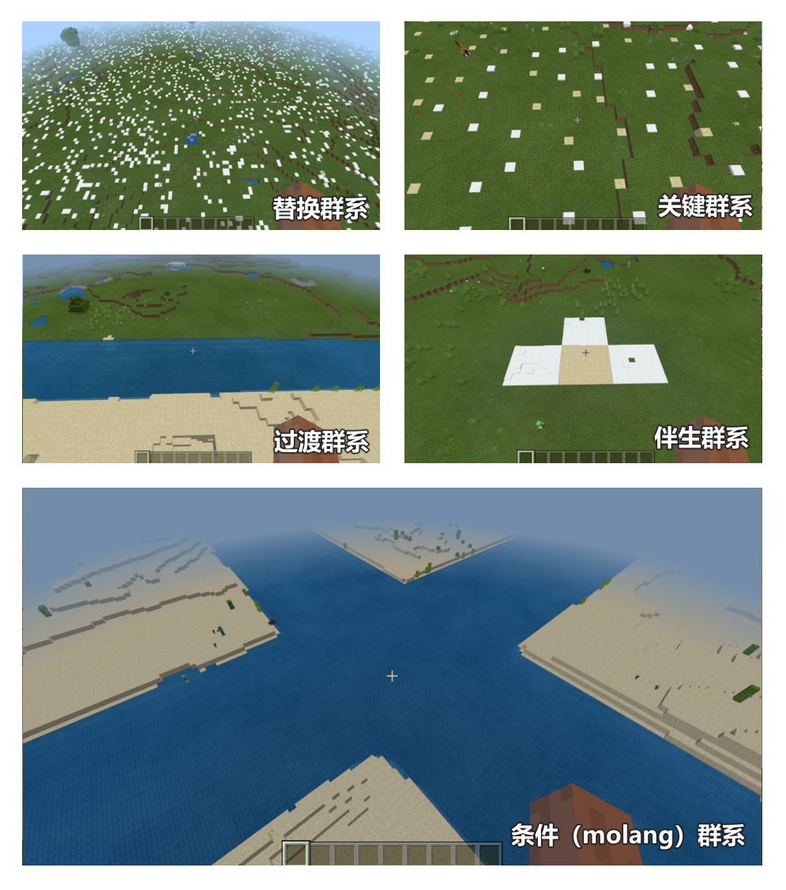

# 2.1

2022.4.15：版本号（v2.1 BE1.17.3）

包括Mod PC包，手机测试版启动器，和服务器引擎。

- 新增重大功能介绍

1. 自定义盾牌

对盾牌的自定义进行了支持，并且额外支持了盾牌的动画和模型，具体的使用请参考<a href="../../../mcguide/20-玩法开发/15-自定义游戏内容/1-自定义物品/8-自定义盾牌.html" rel="noopenner"> 自定义盾牌 </a>。

Demo见：<a href="../../../mcguide/20-玩法开发/13-模组SDK编程/60-Demo示例.html#demomod" rel="noopenner"> 示例简介 </a>

2. 方块合并网格体 & 设置网格体为实体模型

主要实现了3个功能。

1）获取指定的方块为一个方块调色板，调色板内记录有各方块的位置和类型，参考[GetBlockPaletteFromPosList](../接口/世界/方块组合.md#getblockpalettefromposlist)(服务端)以及其他接口。

2）使用方块调色板生成对应的网格体模型，参考[CombineBlockPaletteToGeometry](../接口/方块/方块几何体模型.md#combineblockpalettetogeometry)(客户端)以及其他接口。

3）为实体添加指定的网格体模型，参考[AddActorBlockGeometry](../接口/实体/渲染.md#addactorblockgeometry)(客户端)。

如下图，就是将一些方块合并为了网格体模型，并赋予一个可骑乘实体，实现了类似组装战车的效果。

Demo见：<a href="../../../mcguide/20-玩法开发/13-模组SDK编程/60-Demo示例.html#demomod" rel="noopenner"> 示例简介 </a>

3. 提供更多中国版群系源节点类型

2.1版本的群系源节点能做到以下功能：
1）将某个群系的部分替换成另外一个群系
2）当群系A与群系B相邻时，则在他们中间生成过渡群系
3）在核心群系的周围生成伴生群系
4）在一个固定长宽的矩形范围内，随机选择一个点放置关键群系
5）根据molang语句来实现群系源控制

4. 自定义战利品表扩展

玩家新增幸运值属性，影响战利品数量和权重，详见：<a href="../../../mconline/10-addon教程/第12章：更完善的自定义掉落物/课程02.战利品池.html#补充内容" rel="noopenner"> 战利品池 </a>和[属性值](../枚举值/AttrType.md)。

5. UI控件支持更多设置属性接口

详见[UI控件](../接口/自定义UI/UI控件.md)。

6. 新增屏蔽原版大型结构的10个json组件

可以在维度配置中屏蔽一些大型结构，详见：<a href="../../../mcguide/20-玩法开发/15-自定义游戏内容/4-自定义维度/1-自定义维度.html#维度配置" rel="noopenner"> 维度配置 </a>

7. 新增定义物品描述信息的json字段

新增 netease:customtips 字段，详见：<a href="../../../mcguide/20-玩法开发/15-自定义游戏内容/1-自定义物品/1-自定义基础物品.html#netease-customtips（2-1beta版内容）" rel="noopenner"> netease-customtips </a>

- 新增

1. 新增[StartMemProfile](../接口/通用/调试.md#startmemprofile)(服务端)， 开始启动服务端脚本内存分析<!--by xusifan-->

1. 新增[StopMemProfile](../接口/通用/调试.md#stopmemprofile)(服务端)， 停止服务端脚本内存分析并生成火焰图<!--by xusifan-->

1. 新增[StartMemProfile](../接口/通用/调试.md#startmemprofile)(客户端)， 开始启动客户端脚本内存分析<!--by xusifan-->

1. 新增[StopMemProfile](../接口/通用/调试.md#stopmemprofile)(客户端)， 停止客户端脚本内存分析并生成火焰图<!--by xusifan-->

1. 新增[GetBlankBlockPalette](../接口/世界/方块组合.md#getblankblockpalette)(服务端)， 获取一个空白的方块调色板<!--by xujiarong02-->

1. 新增[GetBlockPaletteFromPosList](../接口/世界/方块组合.md#getblockpalettefromposlist)(服务端)， 根据输入的方块位置列表创建并获取一个方块调色板<!--by xujiarong02-->

1. 新增[GetBlockPaletteBetweenPos](../接口/世界/方块组合.md#getblockpalettebetweenpos)(服务端)， 根据输入的两个方块位置创建并获取一个方块调色板<!--by xujiarong02-->

1. 新增[SetBlockByBlockPalette](../接口/世界/方块组合.md#setblockbyblockpalette)(服务端)， 根据输入的方块调色板内容，将调色板内记录的所有方块设置为实际的方块。<!--by xujiarong02-->

1. 新增[GetBlockBasicInfo](../接口/方块/属性.md#getblockbasicinfo)(服务端)， 获取方块基本信息<!--by xusifan-->

1. 新增[SetBlockBasicInfo](../接口/方块/属性.md#setblockbasicinfo)(服务端)， 设置方块基本信息<!--by gmy-->

1. 新增[GetBlockCollision](../接口/世界/方块管理.md#getblockcollision)(服务端)， 获取指定位置方块当前collision的aabb接口<!--by xusifan-->

1. 新增[GetBlockClip](../接口/世界/方块管理.md#getblockclip)(服务端)， 获取指定位置方块当前clip的aabb接口<!--by xusifan-->

1. 新增[IsSlimeChunk](../接口/世界/地图.md#isslimechunk)(服务端)， 获取某个区块是否史莱姆区块。<!--by gmy-->

1. 新增[OpenMobHitBlockDetection](../事件/实体.md#openmobhitblockdetection)(服务端)， 开启碰撞方块的检测接口<!--by gmy-->

1. 新增[CloseMobHitBlockDetection](../事件/实体.md#closemobhitblockdetection)(服务端)， 关闭碰撞方块的检测接口<!--by gmy-->

1. 新增[SetJumpPower](../接口/实体/行为.md#setjumppower)(服务端)， 设置生物跳跃力度<!--by gmy-->

1. 新增[SetEntityInteractFilter](../接口/实体/行为.md#setentityinteractfilter)(服务端)， 设置与生物可交互的条件<!--by xiegang-->

1. 新增[GetPlayerUIItem](../接口/方块/容器.md#getplayeruiitem)(服务端)， 获取合成容器的物品<!--by jishaobin-->

1. 新增[GetItemDefenceAngle](../接口/物品.md#getitemdefenceangle)(服务端)， 获取盾牌物品的抵挡角度范围<!--by gmy-->

1. 新增[SetItemDefenceAngle](../接口/物品.md#setitemdefenceangle)(服务端)， 设置盾牌物品的抵挡角度范围<!--by gmy-->

1. 新增[SetInputSlotItem](../接口/方块/容器.md#setinputslotitem)(服务端)， 设置熔炉输入栏物品<!--by huangxiaojie03-->

1. 新增[GetInputSlotItem](../接口/方块/容器.md#getinputslotitem)(服务端)， 获取熔炉输入栏物品<!--by huangxiaojie03-->

1. 新增[GetOutputSlotItem](../接口/方块/容器.md#getoutputslotitem)(服务端)， 获取熔炉输出栏物品<!--by huangxiaojie03-->

1. 新增[GetIsBlocking](../接口/玩家/行为.md#getisblocking)(服务端)， 获取玩家是否处于抵挡状态<!--by gmy-->

1. 新增[AddBrewingRecipes](../接口/世界/配方.md#addbrewingrecipes)(服务端)， 新增添加酿造台配方的接口<!--by gmy-->

1. 新增[SetEntityShareablesItems](../接口/实体/行为.md#setentityshareablesitems)(服务端)， 设置实体可分享/可拾取的物品列表<!--by xiegang-->

1. 新增[AddActorRenderControllerArray](../接口/实体/渲染.md#addactorrendercontrollerarray)(客户端)， 添加实体渲染控制器数组中字典arrays元素<!--by xiegang01-->

1. 新增[AddActorBlockGeometry](../接口/实体/渲染.md#addactorblockgeometry)(客户端)， 为实体添加方块几何体模型<!--by xujiarong02-->

1. 新增[DeleteActorBlockGeometry](../接口/实体/渲染.md#deleteactorblockgeometry)(客户端)， 删除实体中的指定方块几何体模型<!--by xujiarong02-->

1. 新增[ClearActorBlockGeometry](../接口/实体/渲染.md#clearactorblockgeometry)(客户端)， 删除实体中的所有的方块几何体模型<!--by xujiarong02-->

1. 新增[SetActorBlockGeometryVisible](../接口/实体/渲染.md#setactorblockgeometryvisible)(客户端)， 设置实体中指定的方块几何体模型是否显示<!--by xujiarong02-->

1. 新增[SetActorAllBlockGeometryVisible](../接口/实体/渲染.md#setactorallblockgeometryvisible)(客户端)， 设置实体中所有的方块几何体模型是否显示<!--by xujiarong02-->

1. 新增[GetBlankBlockPalette](../接口/世界/方块组合.md#getblankblockpalette)(客户端)， 获取一个空白的方块调色板<!--by xujiarong02-->

1. 新增[GetBlockPaletteFromPosList](../接口/世界/方块组合.md#getblockpalettefromposlist)(客户端)， 根据输入的方块位置列表创建并获取一个方块调色板<!--by xujiarong02-->

1. 新增[GetBlockPaletteBetweenPos](../接口/世界/方块组合.md#getblockpalettebetweenpos)(客户端)， 根据输入的两个位置创建并获取一个方块调色板<!--by xujiarong02-->

1. 新增[CombineBlockPaletteToGeometry](../接口/方块/方块几何体模型.md#combineblockpalettetogeometry)(客户端)， 将BlockPalette中的所有方块合并并转换为能用于实体的几何体模型<!--by xujiarong02-->

1. 新增[CombineBlockBetweenPosToGeometry](../接口/方块/方块几何体模型.md#combineblockbetweenpostogeometry)(客户端)， 根据输入的两个位置，搜索这两个位置之间的所有方块，并将这些方块合并和转换为能用于实体的几何体模型<!--by xujiarong02-->

1. 新增[CombineBlockFromPosListToGeometry](../接口/方块/方块几何体模型.md#combineblockfromposlisttogeometry)(客户端)， 根据输入的两个位置，搜索这两个位置之间的所有方块，并将这些方块合并和转换为能用于实体的几何体模型<!--by xujiarong02-->

1. 新增[GetBlockClip](../接口/世界/方块管理.md#getblockclip)(客户端)， 获取指定位置方块当前clip的aabb<!--by xusifan-->

1. 新增[GetBlockCollision](../接口/世界/方块管理.md#getblockcollision)(客户端)， 获取指定位置方块当前collision的aabb<!--by xusifan-->

1. 新增[SetHealthBarDeviation](../接口/实体/渲染.md#sethealthbardeviation)(客户端)， 新增设置血条高度的接口<!--by gmy-->

1. 新增[GetTexture](../接口/模型.md#gettexture)(客户端)， 获取模型贴图名称路径<!--by huangxiaojie03-->

1. 新增[setUsingShield](../接口/玩家/行为.md#setusingshield)(客户端)， 激活盾牌状态<!--by gmy-->

1. 新增[SetFullSize](../接口/自定义UI/UI控件.md#setfullsize)(客户端)， 设置控件的大小，支持百分比以及绝对值<!--by mayexing-->

1. 新增[GetFullSize](../接口/自定义UI/UI控件.md#getfullsize)(客户端)， 获取控件的大小，支持比例值以及绝对值<!--by mayexing-->

1. 新增[SetFullPosition](../接口/自定义UI/UI控件.md#setfullposition)(客户端)， 设置控件的锚点坐标（全局坐标），支持比例值以及绝对值<!--by mayexing-->

1. 新增[GetFullPosition](../接口/自定义UI/UI控件.md#getfullposition)(客户端)， 获取控件的锚点坐标，支持比例值以及绝对值<!--by mayexing-->

1. 新增[SetAnchorFrom](../接口/自定义UI/UI控件.md#setanchorfrom)(客户端)， 设置控件相对于父节点的锚点<!--by mayexing-->

1. 新增[GetAnchorFrom](../接口/自定义UI/UI控件.md#getanchorfrom)(客户端)， 判断控件相对于父节点的哪个锚点来计算位置与大小<!--by mayexing-->

1. 新增[SetAnchorTo](../接口/自定义UI/UI控件.md#setanchorto)(客户端)， 设置控件自身锚点位置<!--by mayexing-->

1. 新增[GetAnchorTo](../接口/自定义UI/UI控件.md#getanchorto)(客户端)， 获取控件自身锚点位置信息<!--by mayexing-->

1. 新增[SetClipOffset](../接口/自定义UI/UI控件.md#setclipoffset)(客户端)， 设置控件的裁剪偏移信息<!--by mayexing-->

1. 新增[GetClipOffset](../接口/自定义UI/UI控件.md#getclipoffset)(客户端)， 获取控件的裁剪偏移信息<!--by mayexing-->

1. 新增[SetClipsChildren](../接口/自定义UI/UI控件.md#setclipschildren)(客户端)， 设置控件是否开启裁剪内容<!--by mayexing-->

1. 新增[GetClipsChildren](../接口/自定义UI/UI控件.md#getclipschildren)(客户端)， 根据控件路径返回某控件是否开启裁剪内容<!--by mayexing-->

1. 新增[SetMaxSize](../接口/自定义UI/UI控件.md#setmaxsize)(客户端)， 设置控件所允许的最大的大小值<!--by mayexing-->

1. 新增[GetMaxSize](../接口/自定义UI/UI控件.md#getmaxsize)(客户端)， 获取控件所允许的最大的大小值<!--by mayexing-->

1. 新增[SetMinSize](../接口/自定义UI/UI控件.md#setminsize)(客户端)， 设置控件所允许的最小的大小值<!--by mayexing-->

1. 新增[GetMinSize](../接口/自定义UI/UI控件.md#getminsize)(客户端)， 获取控件所允许的最小的大小值<!--by mayexing-->

1. 新增[asStackPanel](../接口/自定义UI/UI控件.md#asstackpanel)(客户端)， 将当前BaseUIControl转换为StackPanelUIControl实例<!--by mayexing-->

1. 新增[asInputPanel](../接口/自定义UI/UI控件.md#asinputpanel)(客户端)， 将当前BaseUIControl转换为InputPanelUIControl实例<!--by mayexing-->

1. 新增[SetClipDirection](../接口/自定义UI/UI控件.md#setclipdirection)(客户端)， 设置图片控件的裁剪方向<!--by mayexing-->

1. 新增[GetClipDirection](../接口/自定义UI/UI控件.md#getclipdirection)(客户端)， 获取图片控件的裁剪方向<!--by mayexing-->

1. 新增[SetImageAdaptionType](../接口/自定义UI/UI控件.md#setimageadaptiontype)(客户端)， 设置图片控件的图片适配方式以及信息<!--by mayexing-->

1. 新增[SetIsModal](../接口/自定义UI/UI控件.md#setismodal)(客户端)， 设置当前面板是否为模态框<!--by mayexing-->

1. 新增[GetIsModal](../接口/自定义UI/UI控件.md#getismodal)(客户端)， 判断当前面板是否为模态框<!--by mayexing-->

1. 新增[SetTextAlignment](../接口/自定义UI/UI控件.md#settextalignment)(客户端)， 设置文本控件的文本对齐方式<!--by mayexing-->

1. 新增[GetTextAlignment](../接口/自定义UI/UI控件.md#gettextalignment)(客户端)， 获取文本控件的文本对齐方式<!--by mayexing-->

1. 新增[SetTextLinePadding](../接口/自定义UI/UI控件.md#settextlinepadding)(客户端)， 设置文本控件的行间距<!--by mayexing-->

1. 新增[GetTextLinePadding](../接口/自定义UI/UI控件.md#gettextlinepadding)(客户端)， 获取文本控件的行间距<!--by mayexing-->

1. 新增[EnableTextShadow](../接口/自定义UI/UI控件.md#enabletextshadow)(客户端)， 使文本控件显示阴影<!--by mayexing-->

1. 新增[DisableTextShadow](../接口/自定义UI/UI控件.md#disabletextshadow)(客户端)， 关闭文本控件显示阴影<!--by mayexing-->

1. 新增[IsTextShadowEnabled](../接口/自定义UI/UI控件.md#istextshadowenabled)(客户端)， 判断文本控件是否显示阴影<!--by mayexing-->

1. 新增[SetOrientation](../接口/自定义UI/UI控件.md#setorientation)(客户端)， 设置stackPanel的排列方向<!--by mayexing-->

1. 新增[GetOrientation](../接口/自定义UI/UI控件.md#getorientation)(客户端)， 获取stackPanel的排列方向<!--by mayexing-->

1. 新增[SerializeBlockPalette](../接口/方块/方块调色板.md#serializeblockpalette)(客户端/服务端)， 序列化方块调色板中的数据，用于方块调色板在客户端及服务端的事件数据之间传输<!--by xujiarong02-->

1. 新增[DeserializeBlockPalette](../接口/方块/方块调色板.md#deserializeblockpalette)(客户端/服务端)， 反序列化方块调色板数据字典中的数据，用于方块调色板在客户端及服务端的事件数据之间传输<!--by xujiarong02-->

1. 新增[GetBlockCountInBlockPalette](../接口/方块/方块调色板.md#getblockcountinblockpalette)(客户端/服务端)， 获取方块调色板BlockPalette中某个类型的方块的数量<!--by xujiarong02-->

1. 新增[DeleteBlockInBlockPalette](../接口/方块/方块调色板.md#deleteblockinblockpalette)(客户端/服务端)， 删除方块调色板BlockPalette中某个类型的方块<!--by xujiarong02-->

1. 新增[ReplaceBlockInBlockPalette](../接口/方块/方块调色板.md#replaceblockinblockpalette)(客户端/服务端)， 替换方块调色板BlockPalette中某个类型的方块<!--by xujiarong02-->

1. 新增[ReplaceAirByStructureVoid](../接口/方块/方块调色板.md#replaceairbystructurevoid)(客户端/服务端)， 设置是否将方块调色板BlockPalette中所有空气替换为结构空位<!--by xujiarong02-->

1. 新增[GetVolumeOfBlockPalette](../接口/方块/方块调色板.md#getvolumeofblockpalette)(客户端/服务端)， 获取方块调色板BlockPalette所占据的长方体的长宽高<!--by xujiarong02-->

1. 新增[GetLocalPosListOfBlocks](../接口/方块/方块调色板.md#getlocalposlistofblocks)(客户端/服务端)， 获取方块调色板中某种方块的相对位置列表<!--by xujiarong02-->

1. 新增[OnGroundServerEvent](../事件/实体.md#ongroundserverevent)(服务端)， 服务端实体着地事件<!--by xusifan-->

1. 新增[FurnaceBurnFinishedServerEvent](../事件/物品.md#furnaceburnfinishedserverevent)(服务端)， 服务端熔炉烧制触发事件<!--by huangxiaojie03-->

1. 新增[UIContainerItemChangedServerEvent](../事件/物品.md#uicontaineritemchangedserverevent)(服务端)， 新增合成容器物品变化事件<!--by jishaobin-->

1. 新增[ContainerItemChangedServerEvent](../事件/物品.md#containeritemchangedserverevent)(服务端)， 新增容器物品变化事件<!--by jishaobin-->

1. 新增[OnMobHitBlockServerEvent](../事件/实体.md#onmobhitblockserverevent)(服务端)， 生物和方块碰撞事件<!--by gmy-->

1. 新增[HealthChangeBeforeServerEvent](../事件/实体.md#healthchangebeforeserverevent)(服务端)， 生物生命值发生变化之前的事件<!--by gmy-->

1. 新增[EntityDroppedItemServerEvent](../事件/实体.md#entitydroppeditemserverevent)(服务端)， 生物扔出物品时触发的事件<!--by xiegang-->

1. 新增[EntityPickupItemServerEvent](../事件/实体.md#entitypickupitemserverevent)(服务端)， 生物拾取物品时触发的事件（玩家不触发）<!--by xiegang-->

1. 新增[OnPlayerBlockedByShieldBeforeServerEvent](../事件/物品.md#onplayerblockedbyshieldbeforeserverevent)(服务端)， 玩家使用盾牌抵挡伤害之前触发的事件<!--by guanmingyu-->

1. 新增[OnPlayerBlockedByShieldAfterServerEvent](../事件/物品.md#onplayerblockedbyshieldafterserverevent)(服务端)， 玩家使用盾牌抵挡伤害之后触发的事件<!--by guanmingyu-->

1. 新增[OnPlayerActiveShieldServerEvent](../事件/物品.md#onplayeractiveshieldserverevent)(服务端)， 玩家激活盾牌触发的事件<!--by guanmingyu-->

1. 新增[BlockDestroyByLiquidServerEvent](../事件/方块.md#blockdestroybyliquidserverevent)(服务端)， 方块被水流破坏的事件<!--by guanmingyu-->

1. 新增[FarmBlockToDirtBlockServerEvent](../事件/方块.md#farmblocktodirtblockserverevent)(服务端)， 耕地退化为泥土时触发<!--by guanmingyu-->

1. 新增[DirtBlockToGrassBlockServerEvent](../事件/方块.md#dirtblocktograssblockserverevent)(服务端)， 泥土方块变成草方块时触发<!--by guanmingyu-->

1. 新增[GrassBlockToDirtBlockServerEvent](../事件/方块.md#grassblocktodirtblockserverevent)(服务端)， 草方块变成泥土方块时触发<!--by guanmingyu-->

1. 新增[PlayerDoInteractServerEvent](../事件/实体.md#playerdointeractserverevent)(服务端)， 玩家与生物交互时触发的事件<!--by xiegang-->

1. 新增[BlockBreathability](../枚举值/BlockBreathability.md)， 方块的可呼吸性<!--by xusifan-->

1. 新增[ItemCategory](../枚举值/ItemCategory.md)， 物品所属创造栏类型<!--by xusifan-->

1. 新增[RenderControllerArrayType](../枚举值/RenderControllerArrayType.md)， 渲染控制器字典中材质、贴图、模型的枚举值<!--by xiegang01-->

1. 新增[RenderLayer](../枚举值/RenderLayer.md)， 方块渲染时的材质类型<!--by xusifan-->

- 调整

1. 调整[GetLiquidBlock](../接口/世界/方块管理.md#getliquidblock)(服务端)， 增加一下备注<!--by guanmingyu-->

1. 调整[SetAddArea](../接口/世界/地图.md#setaddarea)(服务端)， 新增fill指令说明<!--by jishaobin-->

1. 调整[SetBlockControlAi](../接口/实体/行为.md#setblockcontrolai)(服务端)， 新增是否冻结动作的参数<!--by czh-->

1. 调整[GetEntitiesAround](../接口/世界/地图.md#getentitiesaround)(服务端)， 增加过滤器中subject的说明<!--by jishaobin-->

1. 调整[CraftItemOutputChangeServerEvent](../事件/物品.md#craftitemoutputchangeserverevent)(服务端)， 新增当前界面类型参数<!--by jishaobin-->

示例Demo下载地址：[2.1 Demo](https://g79.gdl.netease.com/2.1DemoV5.zip)。