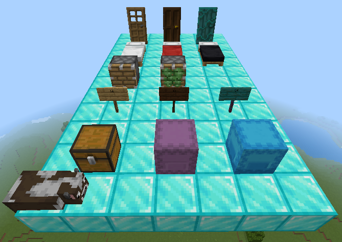
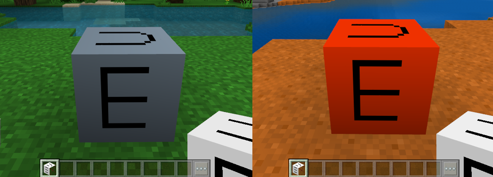
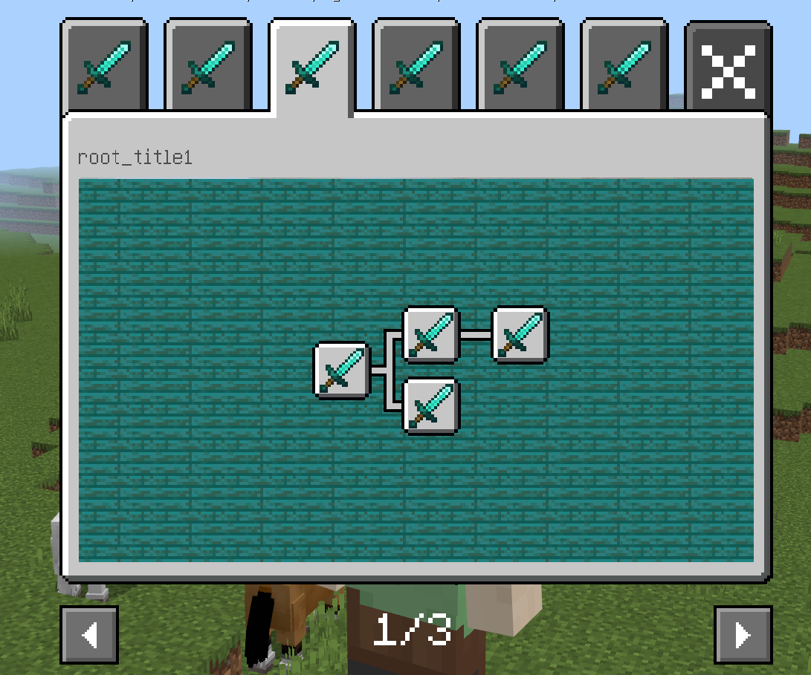

# 2.2

2022.6.21：版本号（v2.2 BE1.18.0）

包括Mod PC包，手机测试版启动器，和服务器引擎。

- 温馨提示

在6月7日，上线2.2第一个beta版。

在6月21日，上线2.2第二个beta版。

在6月30日，上线2.2的稳定版。

在7月8日，全渠道将更新2.2版本玩家包体，玩家将陆续更新到2.2版本，请开发者合理安排更新节奏。

下载[2.2 Demo](https://g79.gdl.netease.com/2.2BetaDemoV4.zip)。

- 新增重大功能介绍

1. 新增对微软粒子的创建，播放控制和挂接支持，详见[微软粒子](../接口/特效/微软粒子.md)

2. 自定义方块自由模型的每张贴图支持最大64×64，关于自定义方块模型的制作请参考<a href="../../../mcguide/20-玩法开发/15-自定义游戏内容/2-自定义方块/5-自定义方块模型.html">这篇文档</a>。

3. 方块几何体模型支持门、床、活塞、粘性活塞、告示牌、箱子类方块

4. 自定义方块及自定义方块模型的群系颜色，详见<a href="../../../mcguide/20-玩法开发/15-自定义游戏内容/2-自定义方块/2-功能.html#自定义方块及自定义方块模型的群系颜色(2.2beta版本内容)" rel="noopenner"> 这篇文档 </a>

5. 部分UI控件支持属性动画，详见<a href="../../../mcguide/18-界面与交互/19-控件属性动画.html" rel="noopenner"> 这篇文档 </a>。

6. 新增自定义成就系统，支持开发者定义自己的成就事件并展示，详见<a href="../../../mcguide/20-玩法开发/15-自定义游戏内容/16-自定义成就系统.html" rel="noopenner">自定义成就</a>

​	

- 特殊说明

自定义维度中，如果使用了群系地貌（netease_biomes目录中定义），则默认使用2d群系规则。

**注：在2.2以及之后的版本，我们对自定义生物的移动流量进行了优化，距离玩家较远的生物会出现瞬移的情况，如果感觉效果较差，可在components手动添加netease:ban_bandwidth_optimization:{}组件来主动关闭此优化**

- 新增

1. 新增[GetRotFromDir](../接口/通用/数学.md#getrotfromdir)(服务端)， 通过玩家当前朝向获取旋转角度<!--by xujiarong-->

1. 新增[GetRotFromDir](../接口/通用/数学.md#getrotfromdir)(客户端)， 通过玩家当前朝向获取旋转角度<!--by xujiarong-->

1. 新增[GetNodeDetailInfo](../接口/自定义UI/自定义成就系统.md#getnodedetailinfo)(服务端)， 获取自定义成就系统的成就节点信息的接口<!--by cxz-->

1. 新增[SetNodeFinish](../接口/自定义UI/自定义成就系统.md#setnodefinish)(服务端)， 设置自定成就系统某个成就节点完成的接口<!--by cxz-->

1. 新增[AddNodeProgress](../接口/自定义UI/自定义成就系统.md#addnodeprogress)(服务端)， 添加自定义成就系统成就节点进度的接口<!--by cxz-->

1. 新增[GetChildrenNode](../接口/自定义UI/自定义成就系统.md#getchildrennode)(服务端)， 获得自定义成就系统中某成就节点的下一级所有孩子节点的接口<!--by cxz-->

1. 新增[LobbyGetAchievementStorage](../接口/成就.md#lobbygetachievementstorage)(服务端)， 获取云成就存储进度的数据接口<!--by cxz-->

1. 新增[LobbySetAchievementStorage](../接口/成就.md#lobbysetachievementstorage)(服务端)， 添加云成就成就进度的数据接口<!--by cxz-->

1. 新增[SetActorBlockGeometryOffset](../接口/方块/方块几何体模型.md#setactorblockgeometryoffset)(客户端)， 设置实体的方块几何体模型的位置偏移。<!--by xujiarong02-->

1. 新增[SetActorBlockGeometryRotation](../接口/方块/方块几何体模型.md#setactorblockgeometryrotation)(客户端)， 设置实体的方块几何体模型的旋转角度。<!--by xujiarong02-->

1. 新增[EnableActorBlockGeometryTransparent](../接口/方块/方块几何体模型.md#enableactorblockgeometrytransparent)(客户端)， 设置是否允许实体的方块几何体模型产生透明度。<!--by xujiarong02-->

1. 新增[SetActorBlockGeometryTransparency](../接口/方块/方块几何体模型.md#setactorblockgeometrytransparency)(客户端)， 设置实体的方块几何体模型的透明度。<!--by xujiarong02-->

1. 新增[Create](../接口/特效/微软粒子.md#create)(客户端)， 创建粒子发射器<!--by dengruitao-->

1. 新增[CreateBindEntity](../接口/特效/微软粒子.md#createbindentity)(客户端)， 创建粒子发射器并绑定实体<!--by dengruitao-->

1. 新增[EmitManually](../接口/特效/微软粒子.md#emitmanually)(客户端)， 手动发射粒子<!--by dengruitao-->

1. 新增[BindEntity](../接口/特效/微软粒子.md#bindentity)(客户端)， 绑定粒子发射器到指定实体<!--by dengruitao-->

1. 新增[Unbind](../接口/特效/微软粒子.md#unbind)(客户端)， 解除粒子发射器绑定<!--by dengruitao-->

1. 新增[SetRelative](../接口/特效/微软粒子.md#setrelative)(客户端)， 设置粒子是否在局部空间进行计算<!--by dengruitao-->

1. 新增[GetBindingID](../接口/特效/微软粒子.md#getbindingid)(客户端)， 获取粒子发射器绑定的目标ID<!--by dengruitao-->

1. 新增[Remove](../接口/特效/微软粒子.md#remove)(客户端)， 销毁指定粒子发射器<!--by dengruitao-->

1. 新增[RemoveByName](../接口/特效/微软粒子.md#removebyname)(客户端)， 销毁所有具有指定identifier的粒子发射器<!--by dengruitao-->

1. 新增[Exist](../接口/特效/微软粒子.md#exist)(客户端)， 判断指定粒子发射器是否存在<!--by dengruitao-->

1. 新增[Play](../接口/特效/微软粒子.md#play)(客户端)， 播放粒子发射器<!--by dengruitao-->

1. 新增[Stop](../接口/特效/微软粒子.md#stop)(客户端)， 停止粒子发射器播放<!--by dengruitao-->

1. 新增[Hide](../接口/特效/微软粒子.md#hide)(客户端)， 隐藏粒子发射器<!--by dengruitao-->

1. 新增[Show](../接口/特效/微软粒子.md#show)(客户端)， 显示粒子发射器<!--by dengruitao-->

1. 新增[Pause](../接口/特效/微软粒子.md#pause)(客户端)， 暂停粒子发射器更新<!--by dengruitao-->

1. 新增[Resume](../接口/特效/微软粒子.md#resume)(客户端)， 恢复粒子发射器更新<!--by dengruitao-->

1. 新增[Replay](../接口/特效/微软粒子.md#replay)(客户端)， 重播粒子发射器<!--by dengruitao-->

1. 新增[PlayAt](../接口/特效/微软粒子.md#playat)(客户端)， 设置粒子发射器播放时间点<!--by dengruitao-->

1. 新增[IsPausing](../接口/特效/微软粒子.md#ispausing)(客户端)， 判断粒子发射器是否被暂停<!--by dengruitao-->

1. 新增[IsHiding](../接口/特效/微软粒子.md#ishiding)(客户端)， 判断粒子发射器是否被隐藏<!--by dengruitao-->

1. 新增[SetPos](../接口/特效/微软粒子.md#setpos)(客户端)， 设置粒子发射器位置<!--by dengruitao-->

1. 新增[GetPos](../接口/特效/微软粒子.md#getpos)(客户端)， 获取粒子发射器位置<!--by dengruitao-->

1. 新增[SetRot](../接口/特效/微软粒子.md#setrot)(客户端)， 设置粒子发射器旋转<!--by dengruitao-->

1. 新增[GetRot](../接口/特效/微软粒子.md#getrot)(客户端)， 获取粒子发射器旋转<!--by dengruitao-->

1. 新增[SetTimeScale](../接口/特效/微软粒子.md#settimescale)(客户端)， 设置粒子发射器播放速度<!--by dengruitao-->

1. 新增[GetTimeScale](../接口/特效/微软粒子.md#gettimescale)(客户端)， 获取粒子发射器播放速度<!--by dengruitao-->

1. 新增[GetDuration](../接口/特效/微软粒子.md#getduration)(客户端)， 获取粒子发射器播放周期<!--by dengruitao-->

1. 新增[GetActiveDuration](../接口/特效/微软粒子.md#getactiveduration)(客户端)， 获取粒子发射器激活周期<!--by dengruitao-->

1. 新增[GetSleepDuration](../接口/特效/微软粒子.md#getsleepduration)(客户端)， 获取粒子发射器休眠周期<!--by dengruitao-->

1. 新增[GetLoopAge](../接口/特效/微软粒子.md#getloopage)(客户端)， 获取粒子发射器周期内已播放时间<!--by dengruitao-->

1. 新增[GetVariable](../接口/特效/微软粒子.md#getvariable)(客户端)， 获取粒子发射器的Molang变量值<!--by dengruitao-->

1. 新增[SetVariable](../接口/特效/微软粒子.md#setvariable)(客户端)， 设置粒子发射器的Molang变量值<!--by dengruitao-->

1. 新增[GetFacingMode](../接口/特效/微软粒子.md#getfacingmode)(客户端)， 返回粒子发射器的粒子朝向模式<!--by dengruitao-->

1. 新增[resetAnimation](../接口/自定义UI/UI控件.md#resetanimation)(客户端)， 重置该控件的动画<!--by panlei-->

1. 新增[SetButtonScreenExitCallback](../接口/自定义UI/UI控件.md#setbuttonscreenexitcallback)(客户端)， 设置按钮所在画布退出时若鼠标仍未抬起时触发回调函数<!--by panlei-->

1. 新增[SetOffsetDelta](../接口/自定义UI/UI控件.md#setoffsetdelta)(客户端)， 设置点击面板的拖拽偏移量<!--by panlei-->

1. 新增[GetOffsetDelta](../接口/自定义UI/UI控件.md#getoffsetdelta)(客户端)， 获得点击面板的拖拽偏移量<!--by panlei-->

1. 新增[OnMobHitMobServerEvent](../事件/实体.md#onmobhitmobserverevent)(服务端)， 生物碰撞事件<!--by wdd-->

1. 新增[OnMobHitMobClientEvent](../事件/实体.md#onmobhitmobclientevent)(客户端)， 生物碰撞事件<!--by wdd-->

- 调整

1. 调整[SetPlayerRideEntity](../接口/玩家/行为.md#setplayerrideentity)(服务端)， 支持骑乘船与矿车<!--by czh-->

1. 调整[SetRiderRideEntity](../接口/实体/行为.md#setriderrideentity)(服务端)， 支持骑乘船与矿车<!--by czh-->

- 废弃（将在未来不可用）

1. 废弃OnPlayerHitMobServerEvent，添加了新事件OnMobHitMobServerEvent代替该事件

1. 废弃OnPlayerHitMobClientEvent，添加了新事件OnMobHitMobClientEvent代替该事件

