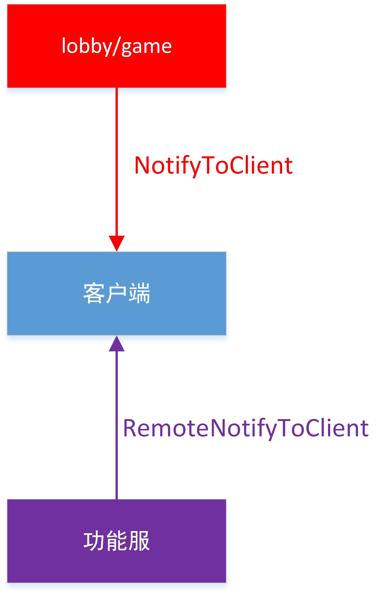
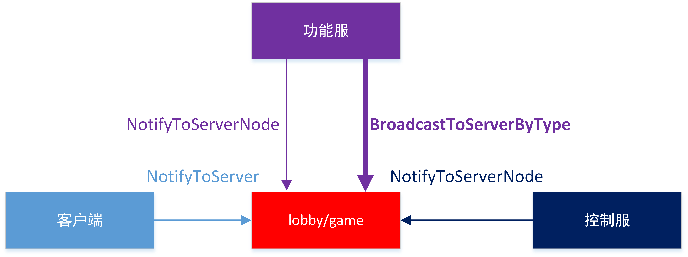
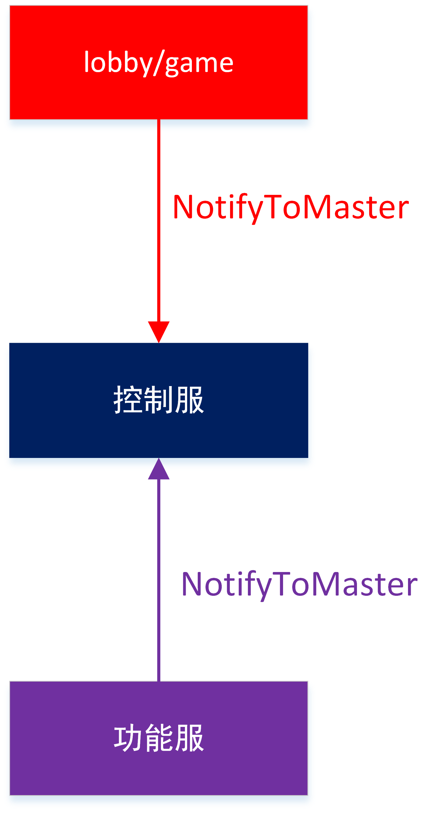
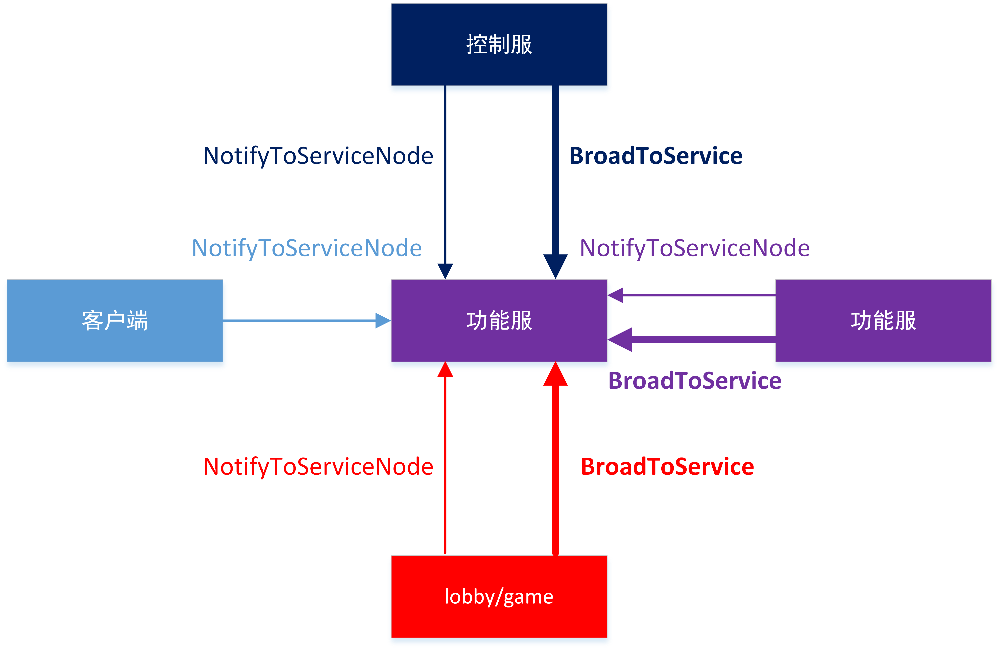
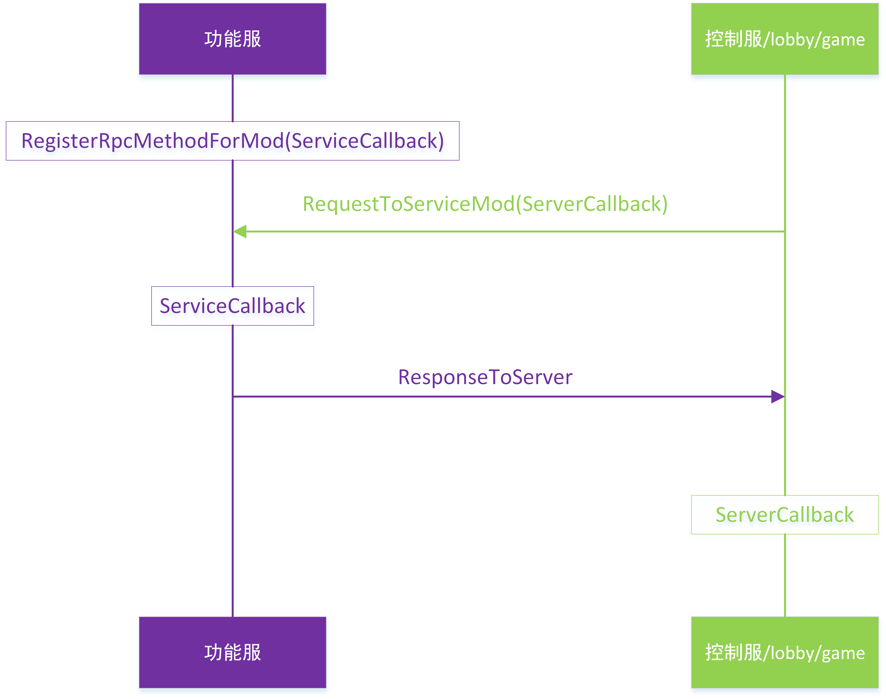

# <span id="8-服务器通信"></span>8-服务器通信

### 通信接口图示

通信接口图示如下

细箭头为单点消息，粗箭头为广播消息


#### 客户端通信接口

发往客户端消息的接口如下




#### lobby/game通信接口

发往lobby/game消息的接口如下




#### 控制服通信接口

发往控制服消息的接口如下



#### 功能服通信接口

发往功能服消息的接口如下




#### 功能服RPC调用流程

1. **功能服**调用`RegisterRpcMethodForMod`注册RPC调用，设置回调函数为`ServiceCallback`
2. **控制服/lobby/game**调用`RequestToServiceMod`触发RPC调用，同时设置回调函数为`ServerCallback`
3. **功能服**执行`ServiceCallback`
4. **功能服**发送响应消息到**控制服/lobby/game**
5. **控制服/lobby/game**执行回调`ServerCallback`

流程如下


Apollo通信相关api。

<span id="client和game/lobby通信"></span>
### client和game/lobby通信

<span id="NotifyToClient"></span>
#### NotifyToClient

- 描述

    game/lobby接口，game/lobby发送事件到指定客户端
    
- 参数

    | 参数名 | 数据类型 | 说明 |
    | :--- | :--- | :--- |
    | targetId | str | 玩家playerId |
    | eventName | str | 事件名 |
    | eventData | dict | 事件参数 |
- 返回值

    无
- 示例

```python
#服务端给客户端发送消息的示例
#client mod
class testClient(ClientSystem):
        def __init__(self,namespace,systemName):
                ClientSystem.__init__(self, namespace, systemName)
                self.ListenForEvent('serverNamespace', 'serverSystem', 'PlayerJoinOKEvent', self, self.OnPlayerJoinOK)
        def OnPlayerJoinOK(self, args):
                #args的结果为：{'uid':123, 'name':'nickname'}
                print 'OnPlayerJoinOK', args
#game/lobby mod
class testServer(ServerSystem):
        def __init__(self, namespace, systemName):
                ServerSystem.__init__(self, namespace, systemName)
        def testNotifyClient(self):
                player = {}
                player['uid'] = 123
                player['name'] = 'nickname'
                playerId = '456'
                self.NotifyToClient(playerId, "PlayerJoinOKEvent", player)
 ```
<span id="NotifyToServer"></span>
#### NotifyToServer

- 描述

    客户端接口，给lobby/game服务器发送事件。注意，玩家只能存在于一个game或lobby，不可能同时存在于两个服务器
    
- 参数

    | 参数名 | 数据类型 | 说明 |
    | :--- | :--- | :--- |
    | eventName | str | 事件名 |
    | eventData | dict | 事件参数 |
- 返回值

    无
- 示例

```python
#客户端给服务端发送消息的示例
#client mod
class testClient(ClientSystem):
        def __init__(self,namespace,systemName):
                ClientSystem.__init__(self, namespace, systemName)
        def testNotifyServer(self):
                player = {}
                player['uid'] = 123
                player['name'] = 'nickname'
                self.NotifyToServer("PlayerJoinEvent", data)
#game/lobby mod
class testServer(ServerSystem):
        def __init__(self, namespace, systemName):
                ServerSystem.__init__(self, namespace, systemName)
                self.ListenForEvent('clientNamespace', 'clientSystem', 'PlayerJoinEvent', self, self.OnPlayerJoin)
        def OnPlayerJoin(self, args):
                #args结果为：{'uid':123, 'name':'nickname'}
                print 'OnPlayerJoin', args
 ```
Apollo通信相关api。

<span id="master和game/lobby通信"></span>
### master和game/lobby通信

<span id="NotifyToMaster"></span>
#### NotifyToMaster

- 描述

    lobby/game接口，lobby/game给master发事件。
    
- 参数

    | 参数名 | 数据类型 | 说明 |
    | :--- | :--- | :--- |
    | eventName | str | 事件名 |
    | eventData | dict | 事件参数 |
- 返回值

    无
- 示例

```python
#服务器给master发消息的示例
#master mod
class testMaster(MasterSystem):
        def __init__(self,namespace,systemName):
                MasterSystem.__init__(self, namespace, systemName)
                self.ListenForEvent('lobbyNamespace', 'lobbySystem', 'PlayerJoinOKEvent', self, self.OnPlayerJoinOK)
        def OnPlayerJoinOK(self, args):
                #args的结果为：{'uid':123, 'name':'nickname'}
                print 'OnPlayerJoinOK', args
#lobby mod
class lobbyServer(ServerSystem):
        def __init__(self, namespace, systemName):
                ServerSystem.__init__(self, namespace, systemName)
        def testNotifyMaster(self, args):
                player = {}
                player['uid'] = 123
                player['name'] = 'nickname'
                self.NotifyToMaster("PlayerJoinOKEvent", player)
 ```
<span id="NotifyToServerNode"></span>
#### NotifyToServerNode

- 描述

    master接口，master给某个lobby/game发事件
    
- 参数

    | 参数名 | 数据类型 | 说明 |
    | :--- | :--- | :--- |
    | targetId | int | lobby/game的服务器id |
    | eventName | str | 事件名 |
    | eventData | dict | 事件参数 |
- 返回值

    无
- 示例

```python
#master给某个服务器发消息的示例
#master mod
class testMaster(MasterSystem):
        def __init__(self,namespace,systemName):
                MasterSystem.__init__(self, namespace, systemName)
        def testNotifyServer(self):
                player = {}
                player['uid'] = 123
                player['name'] = 'nickname'
                self.NotifyToServerNode(4000, "PlayerJoinEvent", data)
#lobby mod，服务器id为4000
class lobbyServer(ServerSystem):
        def __init__(self, namespace, systemName):
                ServerSystem.__init__(self, namespace, systemName)
                self.ListenForEvent('masterNamespace', 'masterSystem', 'PlayerJoinEvent', self, self.OnPlayerJoin)
        def OnPlayerJoin(self, args):
                #args的结果为：{'uid':123, 'name':'nickname'}
                print 'OnPlayerJoin', args
 ```
Apollo通信相关api。

<span id="service和master通信"></span>
### service和master通信

<span id="BroadcastToService"></span>
#### BroadcastToService

- 描述

    master接口，master给所有service广播消息。
    
- 参数

    | 参数名 | 数据类型 | 说明 |
    | :--- | :--- | :--- |
    | eventName | str | 事件名 |
    | eventData | dict | 事件参数 |
- 返回值

    无
- 示例

```python
#master给所有service广播消息。
#service mod
class ServiceApiSys(ServiceSystem):
        def __init__(self,namespace,systemName):
                ServiceSystem.__init__(self, namespace, systemName)
                self.ListenForEvent("NeteaseExtraApi", "extraApiMaster", "MasterBroadcastEvent", self, self.OnMasterBroadcastEvent)
        def OnMasterBroadcastEvent(self, args):
                print "OnMasterBroadcastEvent", args
        
#master mod
class masterServer(MasterSystem):
        def __init__(self, namespace, systemName):
                MasterSystem.__init__(self, namespace, systemName)
                masterHttp.RegisterMasterHttp("/api/service-broadcast-event", self, self.OnServiceBroadcastEvent)
        def OnServiceBroadcastEvent(self, clientId, requestBody):
                reqData = json.loads(requestBody)
                self.BroadcastToService("MasterBroadcastEvent", reqData)
                responseBody = json.dumps({
                        'code': 0,
                        'message': "success",
                        'entity': {},
                })
                masterHttp.SendHttpResponse(clientId, responseBody)
 ```
<span id="NotifyToServiceNode"></span>
#### NotifyToServiceNode

- 描述

    master接口，master给某个service发消息。
    
- 参数

    | 参数名 | 数据类型 | 说明 |
    | :--- | :--- | :--- |
    | targetId | int | service的服务器id |
    | eventName | str | 事件名 |
    | eventData | dict | 事件参数 |
- 返回值

    无
- 示例

```python
#master给某个service发消息。
#service mod
class ServiceApiSys(ServiceSystem):
        def __init__(self,namespace,systemName):
                ServiceSystem.__init__(self, namespace, systemName)
                self.ListenForEvent("NeteaseExtraApi", "extraApiMaster", "MasterEvent", self, self.OnMasterEvent)
        def OnMasterEvent(self, args):
                print "OnMasterEvent", args
#master mod
class masterServer(MasterSystem):
        def __init__(self, namespace, systemName):
                MasterSystem.__init__(self, namespace, systemName)
                masterHttp.RegisterMasterHttp("/api/service-event", self, self.OnServiceEvent)
        def OnServiceEvent(self, clientId, requestBody):
                reqData = json.loads(requestBody)
                self.NotifyToServiceNode(8000, "MasterEvent", reqData)
                responseBody = json.dumps({
                        'code': 0,
                        'message': "success",
                        'entity': {},
                })
                masterHttp.SendHttpResponse(clientId, responseBody)
 ```
<span id="service和service/master通信"></span>
### service和service/master通信

<span id="RegisterRpcMethod"></span>
#### RegisterRpcMethod

- 描述

    service/master接口，用于监听service/master发过来请求，通常用于官方插件开发，服主请使用[RegisterRpcMethodForMod](#RegisterRpcMethodForMod)。要求：MCStudio打开配置文件目录，打开deploy.json文件，然后给service配置module_names信息
    
- 参数

    | 参数名 | 数据类型 | 说明 |
    | :--- | :--- | :--- |
    | module | str | service/master所属模块，deploy.json文件中module_names中某个module |
    | event | str | 事件名 |
    | func | function | 监听函数 |
- 返回值

    无
- 示例

```python
#service同master通信示例.service同service通信与此类似，这里不重复了
        #service mod
class testService(ServiceSystem):
        def __init__(self,namespace,systemName):
                ServiceSystem.__init__(self, namespace, systemName)
                #注册service方法，注意一个事件只能注册一次，否则后面监听函数会覆盖前面监听函数
                self.RegisterRpcMethod('idv_service','PlayerJoinOKEvent', self.OnPlayerJoinOK)
        def OnPlayerJoinOK(self, serverId, callbackId, args):
                #args的结果为：{'uid':123, 'name':'nickname'}
                print 'OnPlayerJoinOK', args
                response = {}
                response['result'] = 1
                self.ResponseToServer(serverId, callbackId, response)
#master mod
class masterServer(MasterSystem):
        def __init__(self, namespace, systemName):
                MasterSystem.__init__(self, namespace, systemName)
        def OnCallback(self, suc, args):
                #若成功：suc=True，args= {'result' : 1}
                #若超时，则suc为False
                if not suc:
                        print 'OnCallback timeout'
                        return
                print 'OnCallback success', args
        def testNotifyService(self):
                player = {}
                player['uid'] = 123
                player['name'] = 'nickname'
                self.RequestToService("idv_service", "PlayerJoinOKEvent", data, self.OnCallback, 2)
 ```
<span id="RegisterRpcMethodForMod"></span>
#### RegisterRpcMethodForMod

- 描述

    service接口，监听service/master发过来的请求。service/master使用[RequestToServiceMod](#RequestToServiceMod)发送请求
    
- 参数

    | 参数名 | 数据类型 | 说明 |
    | :--- | :--- | :--- |
    | func | function | 监听函数 |
    | event | str | 事件名 |
- 返回值

    无
- 示例

```python
#service同master通信示例.service同service通信与此类似，这里不重复了
#service mod
class testService(ServiceSystem):
        def __init__(self,namespace,systemName):
                ServiceSystem.__init__(self, namespace, systemName)
                #注册service方法，注意一个事件只能注册一次，否则后面监听函数会覆盖前面监听函数
                self.RegisterRpcMethodForMod('PlayerJoinOKEvent', self.OnPlayerJoinOK)
        def OnPlayerJoinOK(self, serverId, callbackId, args):
                #args的结果为：{'uid':123, 'name':'nickname'}
                print 'OnPlayerJoinOK', args
                response = {}
                response['result'] = 1
                self.ResponseToServer(serverId, callbackId, response)
#master mod
class masterServer(MasterSystem):
        def __init__(self, namespace, systemName):
                MasterSystem.__init__(self, namespace, systemName)
        def OnCallback(self, suc, args):
                #若成功：suc=True，args= {'result' : 1}
                #若超时，则suc为False
                if not suc:
                        print 'OnCallback timeout'
                        return
                print 'OnCallback success', args
        def testNotifyService(self):
                player = {}
                player['uid'] = 123
                player['name'] = 'nickname'
                self.RequestToServiceMod("idv_service", "PlayerJoinOKEvent", data, self.OnCallback, 2)
 ```
<span id="RequestToService"></span>
#### RequestToService

- 描述

    service/master接口，给service/master发请求，通常用于官方插件开发，服主请使用[RequestToServiceMod](#RequestToServiceMod)
    
- 参数

    | 参数名 | 数据类型 | 说明 |
    | :--- | :--- | :--- |
    | module | str | service/master所属模块，需要在service mod的根目录新增mod.json文件并配置module_names，具体可以参考任意插件中service中mod.json配置 |
    | event | str | 事件名 |
    | eventData | dict | 事件参数 |
    | callback | function | 用于处理service/master返回消息， 默认为空，表示没有回调函数。回调函数参数包括：是否成功状态、service/master返回数据。若超时，则参数为False、None |
    | timeout | int | 回调函数超时时间，单位秒。默认是2s |
- 返回值

    无
- 示例

```python
#service同master通信示例.service同service通信与此类似，这里不重复了
#service mod
class testService(ServiceSystem):
        def __init__(self,namespace,systemName):
                ServiceSystem.__init__(self, namespace, systemName)
        def OnCallbackFromMaster(self, suc, args):
                #若成功：suc=True，args= {'result' : 'hello'}
                #若超时，则suc为False
                if not suc:
                        print 'OnCallback timeout'
                        return
                print 'OnCallbackFromMaster success', args
        def testNotifyMaster(self):
                player = {}
                player['uid'] = 123
                player['name'] = 'nickname'
                self.RequestToService("master_module", "RequestMasterEvent", player, self.OnCallbackFromMaster, 2)
#master mod
class masterServer(MasterSystem):
        def __init__(self, namespace, systemName):
                MasterSystem.__init__(self, namespace, systemName)
                #注册master方法，注意一个事件只能注册一次，否则后面监听函数会覆盖前面监听函数
                self.RegisterRpcMethod("master_module", 'RequestMasterEvent', self.OnRequestMaster)
        def OnRequestMaster(self, serverId, callbackId, args):
                #args结果为：{'uid':123, 'name':'nickname'}
                print 'OnRequestMaster', args
                response = {}
                response['result'] = 'hello'
                self.ResponseToServer(serverId, callbackId, response)
 ```
<span id="RequestToServiceMod"></span>
#### RequestToServiceMod

- 描述

    master接口，给service发请求。要求service调用[RegisterRpcMethodForMod](#RegisterRpcMethodForMod)监听请求
    
- 参数

    | 参数名 | 数据类型 | 说明 |
    | :--- | :--- | :--- |
    | modname | string | service进程的type，对应MCStudio中功能服配置下的“类型”配置 |
    | method | string | 事件名 |
    | args | dict | 事件参数 |
    | callback | function | 用于处理service返回消息，默认为空，表示没有回调函数。回调函数参数包括：是否成功状态、service返回数据。若超时，则参数为False、None |
    | timeout | int | 回调函数超时时间，单位秒。默认是2s |
- 返回值

    无
- 示例

```python
#service同master通信示例.service同service通信与此类似，这里不重复了。
#service mod
class testService(ServiceSystem):
        def __init__(self,namespace,systemName):
                ServiceSystem.__init__(self, namespace, systemName)
                #注册service方法，注意一个事件只能注册一次，否则后面监听函数会覆盖前面监听函数
                self.RegisterRpcMethodForMod('PlayerJoinOKEvent', self.OnPlayerJoinOK)
        def OnPlayerJoinOK(self, serverId, callbackId, args):
                #args的结果为：{'uid':123, 'name':'nickname'}
                print 'OnPlayerJoinOK', args
                response = {}
                response['result'] = 1
                self.ResponseToServer(serverId, callbackId, response)
#master mod
class masterServer(MasterSystem):
        def __init__(self, namespace, systemName):
                MasterSystem.__init__(self, namespace, systemName)
        def OnCallback(self, suc, args):
                #若成功：suc=True，args= {'result' : 1}
                #若超时，则suc为False
                if not suc:
                        print 'OnCallback timeout'
                        return
                print 'OnCallback success', args
        def testNotifyService(self):
                player = {}
                player['uid'] = 123
                player['name'] = 'nickname'
                self.RequestToServiceMod("idv_service", "PlayerJoinOKEvent", data, self.OnCallback, 2)
 ```
<span id="ResponseToServer"></span>
#### ResponseToServer

- 描述

    service/master接口，给service/master返回一个消息。若函数RequestToService的callback参数为空，则不能调用该接口
    
- 参数

    | 参数名 | 数据类型 | 说明 |
    | :--- | :--- | :--- |
    | serverId | int | master/service服务器id |
    | callbackId | int | 回调函数id |
    | eventData | dict | 事件参数 |
- 返回值

    无
- 示例

```python
#service同master通信示例.service同service通信与此类似，这里不重复了
        #service mod
class testService(ServiceSystem):
        def __init__(self,namespace,systemName):
                ServiceSystem.__init__(self, namespace, systemName)
                #注册service方法，注意一个事件只能注册一次，否则后面监听函数会覆盖前面监听函数
                self.RegisterRpcMethodForMod('PlayerJoinOKEvent', self.OnPlayerJoinOK)
        def OnPlayerJoinOK(self, serverId, callbackId, args):
                #args的结果为：{'uid':123, 'name':'nickname'}
                print 'OnPlayerJoinOK', args
                response = {}
                response['result'] = 1
                self.ResponseToServer(serverId, callbackId, response)
#master mod
class masterServer(MasterSystem):
        def __init__(self, namespace, systemName):
                MasterSystem.__init__(self, namespace, systemName)
        def OnCallback(self, suc, args):
                #若成功：suc=True，args= {'result' : 1}
                #若超时，则suc为False
                if not suc:
                        print 'OnCallback timeout'
                        return
                print 'OnCallback success', args
        def testNotifyService(self):
                player = {}
                player['uid'] = 123
                player['name'] = 'nickname'
                self.RequestToServiceMod("idv_service", "PlayerJoinOKEvent", data, self.OnCallback, 2)
 ```
Apollo通信相关api。

<span id="service和master通信"></span>
### service和master通信

<span id="NotifyToMaster"></span>
#### NotifyToMaster

- 描述

    service接口，service给master发消息。
    
- 参数

    | 参数名 | 数据类型 | 说明 |
    | :--- | :--- | :--- |
    | eventName | str | 事件名 |
    | eventData | dict | 事件参数 |
- 返回值

    无
- 示例

```python
#service给master发消息。
#master mod
class MasterApiSys(MasterSystem):
        def __init__(self,namespace,systemName):
                MasterSystem.__init__(self, namespace, systemName)
                self.ListenForEvent('NeteaseExtraApi', 'extraApiService', 'ServiceEvent', self, self.OnServiceEvent)
        def OnServiceEvent(self, args):
                print "OnServiceEvent", args
#service mod
class ServiceApiSys(ServiceSystem):
        def __init__(self, namespace, systemName):
                ServiceSystem.__init__(self, namespace, systemName)
        def DoSendToMaster(self, args):
                self.NotifyToMaster("ServiceEvent", args)
 ```
<span id="service和game/lobby通信"></span>
### service和game/lobby通信

<span id="BroadcastToServerByType"></span>
#### BroadcastToServerByType

- 描述

    service接口，service给某种类型服务器广播消息
    
- 参数

    | 参数名 | 数据类型 | 说明 |
    | :--- | :--- | :--- |
    | serverType | str | lobby/game的服务类型 |
    | eventName | str | 事件名 |
    | eventData | dict | 事件参数 |
- 返回值

    无
- 示例

```python
#service同game/lobby通信示例
#service mod
import server.extraServiceApi as serviceApi
ServiceSystem = serviceApi.GetServiceSystemCls()
class testService(ServiceSystem):
        def __init__(self,namespace,systemName):
                ServiceSystem.__init__(self, namespace, systemName)
        def testNotify(self):
                player = {}
                player['uid'] = 123
                player['name'] = 'nickname'
                self.BroadcastToServerByType('battle_game_server_type', 
                        "PlayerJoinEvent", player)
#lobby mod(服务器类型为battle_game_server_type)
class lobbyServer(ServerSystem):
        def __init__(self, namespace, systemName):
                ServerSystem.__init__(self, namespace, systemName)
                self.ListenForEvent('serviceNamespace', 'serviceSystem', 
                        'PlayerJoinEvent', self, self.OnPlayerJoin)
        def OnPlayerJoin(self, args):
                #args的结果为：{'uid':123, 'name':'nickname'}
                print 'OnPlayerJoin', args
 ```
<span id="BroadcastToService"></span>
#### BroadcastToService

- 描述

    service/lobby/game接口，service/lobby/game给所有service广播消息。
    
- 参数

    | 参数名 | 数据类型 | 说明 |
    | :--- | :--- | :--- |
    | eventName | str | 事件名 |
    | eventData | dict | 事件参数 |
- 返回值

    无
- 示例

```python
#service/lobby/game给所有service广播消息。
#service mod
class ServiceApiSys(ServiceSystem):
        def __init__(self,namespace,systemName):
                ServiceSystem.__init__(self, namespace, systemName)
                self.ListenForEvent("NeteaseExtraApi", "extraApiDev", "ServerBroadcastEvent", self, self.OnServerBroadcastEvent)
                self.ListenForEvent("NeteaseExtraApi", "extraApiService", "ServiceBroadcastEvent", self, self.OnServiceBroadcastEvent)
        def OnServerBroadcastEvent(self, args):
                print "OnServerBroadcastEvent", args
                self.BroadcastToService("ServiceBroadcastEvent", args)
        
        def OnServiceBroadcastEvent(self, args):
                print "OnServiceBroadcastEvent", args
        
#lobby mod
class lobbyServer(ServerSystem):
        def __init__(self, namespace, systemName):
                ServerSystem.__init__(self, namespace, systemName)
        def DoBroadcastToService(self, args):
                self.BroadcastToService("ServerBroadcastEvent", args)
 ```
<span id="NotifyToServerNode"></span>
#### NotifyToServerNode

- 描述

    service接口，service给某个lobby/game发消息。
    
- 参数

    | 参数名 | 数据类型 | 说明 |
    | :--- | :--- | :--- |
    | targetId | int | lobby/game的服务器id |
    | eventName | str | 事件名 |
    | eventData | dict | 事件参数 |
- 返回值

    无
- 示例

```python
#service给game/lobby发消息
#service mod
class testService(ServiceSystem):
        def __init__(self,namespace,systemName):
                ServiceSystem.__init__(self, namespace, systemName)
        def testNotifyServer(self):
                player = {}
                player['uid'] = 123
                player['name'] = 'nickname'
                self.NotifyToServerNode(4000, "PlayerJoinEvent", player)
#lobby mod
class lobbyServer(ServerSystem):
        def __init__(self, namespace, systemName):
                ServerSystem.__init__(self, namespace, systemName)
                self.ListenForEvent('serviceNamespace', 'serviceSystem', 'PlayerJoinEvent', self, self.OnPlayerJoin)
        def OnPlayerJoin(self, args):
                #args的结果为：{'uid':123, 'name':'nickname'}
                print 'OnPlayerJoin', args
 ```
<span id="NotifyToServiceNode"></span>
#### NotifyToServiceNode

- 描述

    service/lobby/game接口，service/lobby/game给某个service发消息。
    
- 参数

    | 参数名 | 数据类型 | 说明 |
    | :--- | :--- | :--- |
    | targetId | int | service的服务器id |
    | eventName | str | 事件名 |
    | eventData | dict | 事件参数 |
- 返回值

    无
- 示例

```python
#service/lobby/game给某个service发消息
#service mod
class ServiceApiSys(ServiceSystem):
        def __init__(self,namespace,systemName):
                ServiceSystem.__init__(self, namespace, systemName)
                self.ListenForEvent("NeteaseExtraApi", "extraApiDev", "ServerEvent", self, self.OnServerEvent)
                self.ListenForEvent("NeteaseExtraApi", "extraApiService", "ServiceEvent", self, self.OnServiceEvent)
        def OnServerEvent(self, args):
                print "OnServerEvent", args
                self.NotifyToServiceNode(8001, "ServiceEvent", args)
        def OnServiceEvent(self, args):
                print "OnServiceEvent", args
        
#lobby mod
class lobbyServer(ServerSystem):
        def __init__(self, namespace, systemName):
                ServerSystem.__init__(self, namespace, systemName)
        def DoSendToService(self, args):
                self.NotifyToServiceNode(8000, "ServerEvent", args)
 ```
<span id="RegisterRpcMethod"></span>
#### RegisterRpcMethod

- 描述

    service接口，通常用于官方插件开发，服主请使用[RegisterRpcMethodForMod](#RegisterRpcMethodForMod)。本接口注册一个监听函数，用于监听lobby/game发过来的请求。
    
- 参数

    | 参数名 | 数据类型 | 说明 |
    | :--- | :--- | :--- |
    | module | str | service所属模块，需要在service mod的根目录新增mod.json文件并配置module_names，具体可以参考任意插件中service中mod.json配置 |
    | func | function | 监听函数 |
    | event | str | 事件名 |
- 返回值

    无
- 示例

```python
#service同game/lobby通信示例
#service mod
class testService(ServiceSystem):
        def __init__(self,namespace,systemName):
                ServiceSystem.__init__(self, namespace, systemName)
                self.RegisterRpcMethod("idv_service", 'PlayerJoinOKEvent', self.OnPlayerJoinOK)
        def OnPlayerJoinOK(self, serverId, callbackId, args):
                #args的结果为：{'uid':123, 'name':'nickname'}
                print 'OnPlayerJoinOK', args
#lobby mod
class lobbyServer(ServerSystem):
        def __init__(self, namespace, systemName):
                ServerSystem.__init__(self, namespace, systemName)
        def testNotifyService(self):
                player = {}
                player['uid'] = 123
                player['name'] = 'nickname'
                self.RequestToService("idv_service", "PlayerJoinOKEvent", args)
 ```
<span id="RegisterRpcMethodForMod"></span>
#### RegisterRpcMethodForMod

- 描述

    service接口，监听lobby/game发过来的请求，lobby/game使用[RequestToServiceMod](#RequestToServiceMod)发送请求
    
- 参数

    | 参数名 | 数据类型 | 说明 |
    | :--- | :--- | :--- |
    | method | string | 事件名 |
    | func | function | 监听函数 |
- 返回值

    无
- 示例

```python
#service同game/lobby通信示例
#service mod
class testService(ServiceSystem):
        def __init__(self,namespace,systemName):
                ServiceSystem.__init__(self, namespace, systemName)
                self.RegisterRpcMethodForMod('PlayerJoinOKEvent', self.OnPlayerJoinOK)
        def OnPlayerJoinOK(self, serverId, callbackId, args):
                #args的结果为：{'uid':123, 'name':'nickname'}
                print 'OnPlayerJoinOK', args
                response = {}
                response['result'] = 1
                self.ResponseToServer(serverId, callbackId, response)
#lobby mod
class lobbyServer(ServerSystem):
        def __init__(self, namespace, systemName):
                ServerSystem.__init__(self, namespace, systemName)
        def OnCallback(self, suc, args):
                #若成功：suc=True，args= {'result' : 1}
                #若超时，则suc为False
                if not suc:
                        print 'OnCallback timeout'
                        return
                print 'OnCallback success', args
        def testNotifyService(self):
                player = {}
                player['uid'] = 123
                player['name'] = 'nickname'
                self.RequestToServiceMod("idv_service", "PlayerJoinOKEvent", args, self.OnCallback, 2)
 ```
<span id="RequestToService"></span>
#### RequestToService

- 描述

    service/lobby/game接口，通常用于官方插件开发，服主请使用[RequestToServiceMod](#RequestToServiceMod)。lobby/game给service发请求，两个service间可以通过这个接口通信
    
- 参数

    | 参数名 | 数据类型 | 说明 |
    | :--- | :--- | :--- |
    | module | str | service所属模块，需要在service mod的根目录新增mod.json文件并配置module_names，具体可以参考任意插件中service中mod.json配置 |
    | event | str | 事件名 |
    | eventData | dict | 事件参数 |
    | callback | function | 用于处理service返回消息，默认为空，表示没有回调函数。回调函数参数包括：是否成功状态、service返回数据。若超时，则参数为False、None |
    | timeout | int | 回调函数超时时间，单位秒。默认是2s |
- 返回值

    无
- 示例

```python
#service同game/lobby通信示例
#service mod
class testService(ServiceSystem):
        def __init__(self,namespace,systemName):
                ServiceSystem.__init__(self, namespace, systemName)
                self.RegisterRpcMethod("idv_service", 'PlayerJoinOKEvent', self.OnPlayerJoinOK)
        def OnPlayerJoinOK(self, serverId, callbackId, args):
                #args的结果为：{'uid':123, 'name':'nickname'}
                print 'OnPlayerJoinOK', args
#lobby mod
class lobbyServer(ServerSystem):
        def __init__(self, namespace, systemName):
                ServerSystem.__init__(self, namespace, systemName)
        def testNotifyService(self):
                player = {}
                player['uid'] = 123
                player['name'] = 'nickname'
                self.RequestToService("idv_service", "PlayerJoinOKEvent", args)
 ```
<span id="RequestToServiceMod"></span>
#### RequestToServiceMod

- 描述

    lobby/game接口，lobby/game给service发送事件。要求service调用[RegisterRpcMethodForMod](#RegisterRpcMethodForMod)监听请求
    
- 参数

    | 参数名 | 数据类型 | 说明 |
    | :--- | :--- | :--- |
    | modname | string | service进程的type，对应MCStudio中功能服配置下的“类型”配置 |
    | method | string | 事件名 |
    | args | dict | 事件参数 |
    | callback | function | 用于处理service返回消息，默认为空，表示没有回调函数。回调函数参数包括：是否成功状态、service返回数据。若超时，则参数为False、None |
    | timeout | int | 回调函数超时时间，单位秒。默认是2s |
- 返回值

    无
- 示例

```python
#service同game/lobby通信示例
#service mod
class testService(ServiceSystem):
        def __init__(self,namespace,systemName):
                ServiceSystem.__init__(self, namespace, systemName)
                self.RegisterRpcMethodForMod('PlayerJoinOKEvent', self.OnPlayerJoinOK)
        def OnPlayerJoinOK(self, serverId, callbackId, args):
                #args的结果为：{'uid':123, 'name':'nickname'}
                print 'OnPlayerJoinOK', args
                response = {}
                response['result'] = 1
                self.ResponseToServer(serverId, callbackId, response)
#lobby mod
class lobbyServer(ServerSystem):
        def __init__(self, namespace, systemName):
                ServerSystem.__init__(self, namespace, systemName)
        def OnCallback(self, suc, args):
                #若成功：suc=True，args= {'result' : 1}
                #若超时，则suc为False
                if not suc:
                        print 'OnCallback timeout'
                        return
                print 'OnCallback success', args
        def testNotifyService(self):
                player = {}
                player['uid'] = 123
                player['name'] = 'nickname'
                self.RequestToServiceMod("idv_service", "PlayerJoinOKEvent", args, self.OnCallback, 2)
 ```
<span id="ResponseToServer"></span>
#### ResponseToServer

- 描述

    service接口，给lobby/game返回一个消息。若函数RequestToService的callback参数为空，则不能调用该接口
    
- 参数

    | 参数名 | 数据类型 | 说明 |
    | :--- | :--- | :--- |
    | serverId | int | lobby/game服务器id |
    | callbackId | int | 回调函数id |
    | eventData | dict | 事件参数 |
- 返回值

    无
- 示例

```python
#service同game/lobby通信示例
#service mod
class testService(ServiceSystem):
        def __init__(self,namespace,systemName):
                ServiceSystem.__init__(self, namespace, systemName)
                self.RegisterRpcMethodForMod('PlayerJoinOKEvent', self.OnPlayerJoinOK)
        def OnPlayerJoinOK(self, serverId, callbackId, args):
                #args的结果为：{'uid':123, 'name':'nickname'}
                print 'OnPlayerJoinOK', args
                response = {}
                response['result'] = 1
                self.ResponseToServer(serverId, callbackId, response)
#lobby mod
class lobbyServer(ServerSystem):
        def __init__(self, namespace, systemName):
                ServerSystem.__init__(self, namespace, systemName)
        def OnCallback(self, suc, args):
                #若成功：suc=True，args= {'result' : 1}
                #若超时，则suc为False
                if not suc:
                        print 'OnCallback timeout'
                        return
                print 'OnCallback success', args
        def testNotifyService(self):
                player = {}
                player['uid'] = 123
                player['name'] = 'nickname'
                self.RequestToServiceMod("idv_service", "PlayerJoinOKEvent", args, self.OnCallback, 2)
 ```
Apollo通信相关api。

<span id="client和service通信"></span>
### client和service通信

<span id="NotifyToServiceNode"></span>
#### NotifyToServiceNode

- 描述

    客户端接口，给service服务器发送事件
    
- 参数

    | 参数名 | 数据类型 | 说明 |
    | :--- | :--- | :--- |
    | serverId | int | 服务器id |
    | eventName | str | 事件名 |
    | eventData | dict | 事件参数，包含：`__neteaseProxyId__`，表示当前客户端连接的proxy服务器id；`__uid__`，表示当前客户端的uid |
- 返回值

    无
- 示例

```python
#客户端给service发送消息的示例
#client mod
import client.extraClientApi as clientApi
ClientSystem = clientApi.GetClientSystemCls()
class testClient(ClientSystem):
        def __init__(self,namespace,systemName):
                ClientSystem.__init__(self, namespace, systemName)
        def testNotify(self):
                player = {}
                player['name'] = 'nickname'
                self.NotifyToServiceNode(8000, 'ClientToServiceEvent', player)
#service mod
class testService(ServiceSystem):
        def __init__(self, namespace, systemName):
                ServiceSystem.__init__(self, namespace, systemName)
                self.ListenForEvent('clientNamespace', 'clientSystem', 'ClientToServiceEvent', self, self.OnClientToService)
        def OnClientToService(self, args):
                #args结果：{'__neteaseProxyId__': 2000, '__uid__': 123, 'name': nickname}
                print 'OnClientToService', args
 ```
<span id="RemoteNotifyToClient"></span>
#### RemoteNotifyToClient

- 描述

    service接口，service发送事件到指定客户端
    
- 参数

    | 参数名 | 数据类型 | 说明 |
    | :--- | :--- | :--- |
    | uid | int/long | 玩家的netease uid，玩家的唯一标识 |
    | proxyId | int | 当前客户端连接的proxy服务器id，可以通过NotifyToServiceNode、AddServerPlayerEvent、GetOnlineServerInfoOfPlayer、GetOnlineServerInfoOfMultiPlayers接口或事件获取该参数 |
    | eventName | str | 事件名 |
    | eventData | dict | 事件参数 |
- 返回值

    无
- 示例

```python
#service给客户端发送消息的示例
#client mod
import client.extraClientApi as clientApi
ClientSystem = clientApi.uid()
class testClient(ClientSystem):
        def __init__(self,namespace,systemName):
                ClientSystem.__init__(self, namespace, systemName)
                self.ListenForEvent('serviceNamespace', 'serviceSystem', 'ServiceToClientEvent', self, self.OnServiceToClient)
        def OnServiceToClient(self, args):
                #args的结果：{'uid': 123, 'name': nickname}
                print 'OnServiceToClient', args
#service mod
class testService(ServiceSystem):
        def __init__(self, namespace, systemName):
                ServiceSystem.__init__(self, namespace, systemName)
        def testNotify(self):
                player = {}
                player['uid'] = 123
                player['name'] = 'nickname'
                self.RemoteNotifyToClient(123, 8000, 'ServiceToClientEvent', player)
 ```
